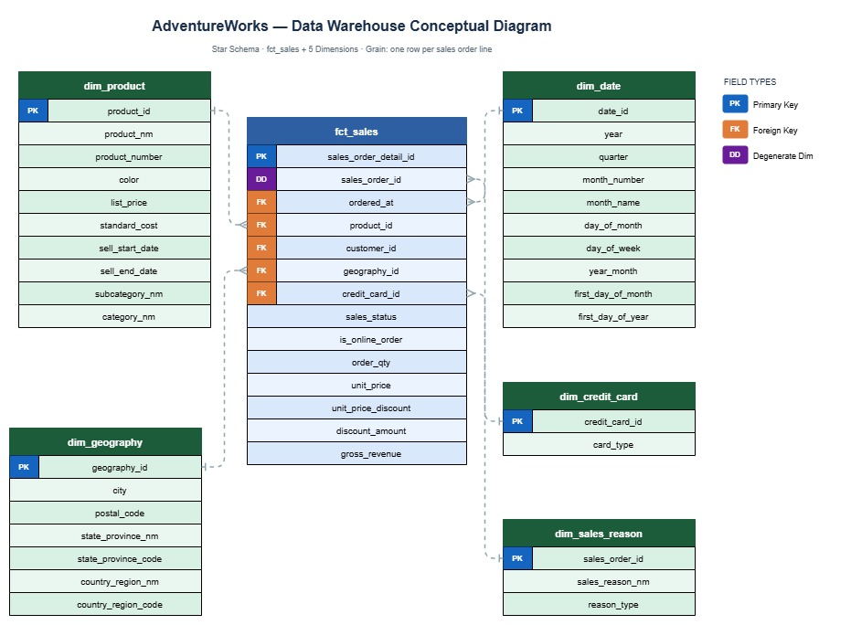

# AdventureWorks Indicium — Projeto de Analytics Engineering

Este repositório contém a implementação do desafio de **Analytics Engineer** da Indicium, utilizando práticas do **Modern Analytics Stack** com **dbt** para modelagem de dados e preparação de camadas analíticas.

## 🎯 Objetivo do projeto

Construir uma plataforma analítica confiável para a Adventure Works, permitindo responder perguntas de negócio sobre:

- volume de pedidos e quantidades vendidas;
- faturamento e ticket médio por diferentes granularidades;
- desempenho por produto, cliente e localização;
- análise temporal (mês/ano);
- comportamento de vendas por motivo (ex.: *Promotion*).

Além de responder às perguntas analíticas, o projeto também prioriza:

- **qualidade e confiabilidade dos dados** (testes e validações);
- **rastreabilidade** da transformação dos dados;
- **documentação técnica** dos modelos analíticos.

---

## 🧱 Arquitetura de camadas

A modelagem segue uma arquitetura em camadas no dbt:

### 1) `sources` (origem)
Definição e documentação das tabelas brutas disponibilizadas no ambiente de dados (Databricks), com testes básicos de integridade em `models/staging/_sources.yml`.

### 2) `staging` (padronização)
Camada para limpeza e padronização inicial, composta pelos modelos:

- `stg_person__addresses`
- `stg_person__countryregions`
- `stg_person__stateprovinces`
- `stg_production__product_categories`
- `stg_production__product_subcategories`
- `stg_production__products`
- `stg_sales__creditcards`
- `stg_sales__customers`
- `stg_sales__salesorderdetails`
- `stg_sales__salesorderheaders`
- `stg_sales__salesorderheadersalesreasons`
- `stg_sales__salesreasons`

Esses modelos renomeiam colunas, padronizam tipos, removem ambiguidades de nomenclatura e preservam granularidade próxima da origem.

### 3) `intermediate` (regras de negócio)
Camada para aplicar regras de negócio reutilizáveis, preparar joins e enriquecimentos e reduzir a complexidade dos marts finais. Os modelos dessa camada são:

- `int_orders_enriched`
- `int_products_enriched`
- `int_sales_reason`

### 4) `marts` (consumo analítico)
Camada final com modelos dimensionais e métricas para BI. Os modelos implementados no projeto são:

#### Fato
- `fct_sales`

#### Dimensões
- `dim_credit_card`
- `dim_date`
- `dim_geography`
- `dim_product`
- `dim_sales_reason`

---

## 🗂️ Fontes de dados

As fontes são dados transacionais e cadastrais da Adventure Works, incluindo domínios como:

- pedidos e itens de pedidos;
- produtos e categorias;
- clientes;
- cartões/tipos de pagamento;
- motivos de venda;
- endereços (cidade, estado, país);
- status de pedidos;
- datas de venda.

> As tabelas de origem e seus campos estão documentados no projeto dbt via `sources` + `docs`.

---

## 📊 Principais modelos analíticos

A estrutura analítica foi desenhada para suportar as perguntas de negócio do desafio.

### Fato principal
- **`fct_sales`**: granularidade por item de pedido/venda, consolidando métricas de pedidos, quantidade, valores e chaves analíticas para produto, cliente, data, geografia, motivo de venda e cartão de crédito.

### Dimensões implementadas
- **`dim_product`**
- **`dim_date`**
- **`dim_geography`**
- **`dim_sales_reason`**
- **`dim_credit_card`**

### Modelos intermediários de apoio
- **`int_orders_enriched`**
- **`int_products_enriched`**
- **`int_sales_reason`**

### Métricas derivadas
- **Ticket médio** por período/localidade/produto:
  - `ticket_medio = (faturamento_bruto - descontos) / número_pedidos`



---

## ✅ Qualidade de dados

O projeto inclui testes em dbt para garantir confiabilidade:

- testes em **sources** (ex.: `not_null`, `relationships`);
- testes de unicidade e não nulidade nas chaves primárias dos modelos dimensionais e fato;
- testes de consistência de dados e regras de negócio;
- documentação de tabelas e colunas nos arquivos `.yml` dos modelos.

---

## 🚀 Como executar o projeto

### Pré-requisitos
- Python 3.9+  
- dbt instalado (adapter compatível com Databricks)
- perfil configurado em `~/.dbt/profiles.yml` para o ambiente alvo

### 1) Instalar dependências do dbt
```bash
dbt deps
```

### 2) Validar conexão (opcional, recomendado)
```bash
dbt debug
```

### 3) Executar build completo (modelos + testes + snapshots/seeds quando aplicável)
```bash
dbt build
```

### 4) Gerar e visualizar documentação (opcional)
```bash
dbt docs generate
dbt docs serve
```

---

## 📁 Estrutura do repositório

```text
.
├── models/
│   ├── staging/
│   │   ├── _sources.yml
│   │   ├── stg_person__addresses.sql
│   │   ├── stg_person__countryregions.sql
│   │   ├── stg_person__stateprovinces.sql
│   │   ├── stg_production__product_categories.sql
│   │   ├── stg_production__product_subcategories.sql
│   │   ├── stg_production__products.sql
│   │   ├── stg_sales__creditcards.sql
│   │   ├── stg_sales__customers.sql
│   │   ├── stg_sales__salesorderdetails.sql
│   │   ├── stg_sales__salesorderheaders.sql
│   │   ├── stg_sales__salesorderheadersalesreasons.sql
│   │   └── stg_sales__salesreasons.sql
│   ├── intermediate/
│   │   ├── int_orders_enriched.sql
│   │   ├── int_products_enriched.sql
│   │   └── int_sales_reason.sql
│   └── marts/
│       ├── dim_credit_card.sql
│       ├── dim_date.sql
│       ├── dim_geography.sql
│       ├── dim_product.sql
│       ├── dim_sales_reason.sql
│       └── fct_sales.sql
├── dbt_project.yml
└── README.md
```

---

## 🧠 Perguntas de negócio atendidas

Este projeto foi desenvolvido para responder, entre outras, às seguintes perguntas:

1. Número de pedidos, quantidade e valor total negociado por produto/cartão/motivo/data/cliente/status/cidade/estado/país.  
2. Produtos com maior ticket médio por mês/ano/cidade/estado/país.  
3. Top 10 clientes por valor total negociado com filtros analíticos.  
4. Top 5 cidades por valor total negociado com filtros analíticos.  
5. Evolução temporal (mês/ano) de pedidos, quantidade e valor negociado.  
6. Produto com maior quantidade vendida para o motivo de venda **Promotion**.

---

## 🛠️ Stack utilizada

- **dbt** — transformação e modelagem analítica  
- **Databricks** — data warehouse/lakehouse em nuvem  
- **Looker Studio / Data Studio** — visualização e dashboards
- https://datastudio.google.com/reporting/3357eb81-0ed7-4e14-a8ec-7c7a209676cd

---

## 👥 Público-alvo

- Time de Analytics Engineering  
- Stakeholders de negócio (diretoria, áreas comerciais e de inovação)  
- Time de BI e Analytics Consumers

---
